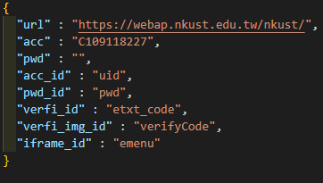
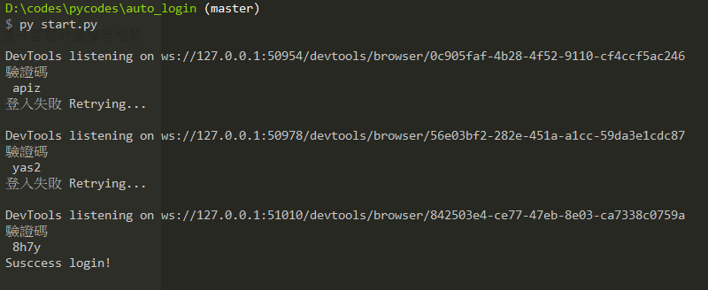

<h1>此檔案用於自動嘗試登入，並輸入驗證碼</h1>

測試網址:
https://webap.nkust.edu.tw/nkust/

<h2>使用方式</h2>

一、先將settings_sample.json改名為settings.json，並分別輸入
  1. 網址
  2. 帳號
  3. 密碼
  4. 帳號輸入欄位的id或name
  5. 密碼輸入欄位的id或name
  6. 驗證碼圖片的id或name
  7. 驗證碼輸入欄位的id或name
  8. 帳密欄位若被包裝在iframe內，則輸入iframe的id或name

二、直接使用 cmd 執行 start.py，程式將會開始自動執行，直到成功登入或達到嘗試次數上限為止。

三、細節改動
暫無
